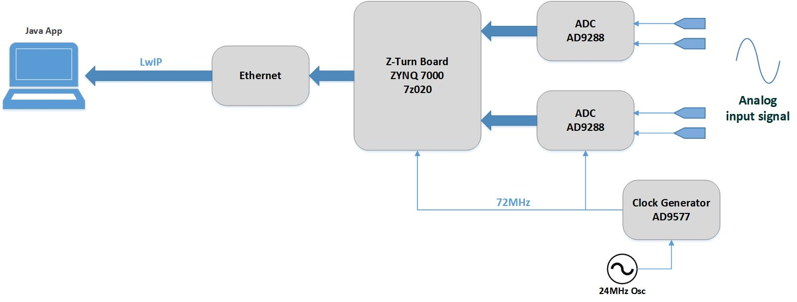
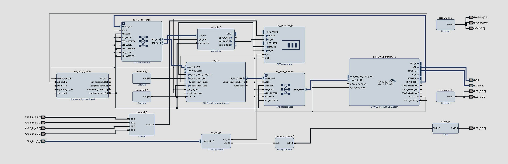
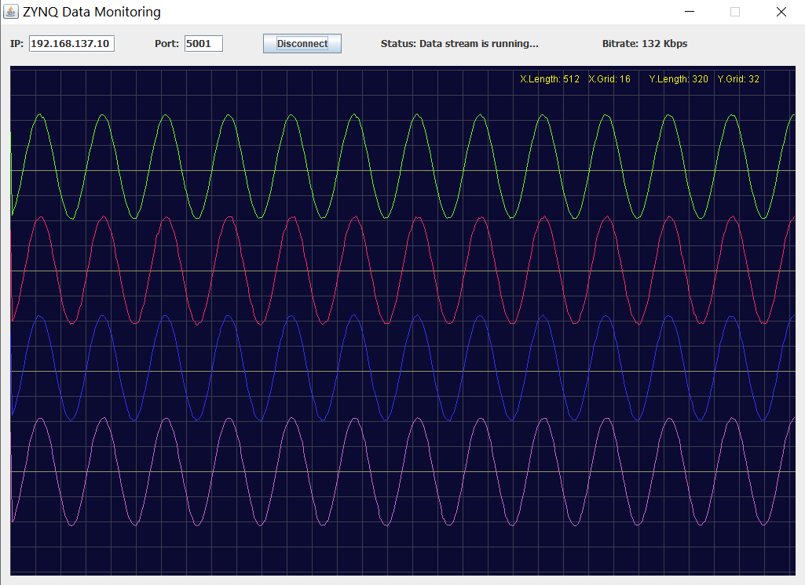
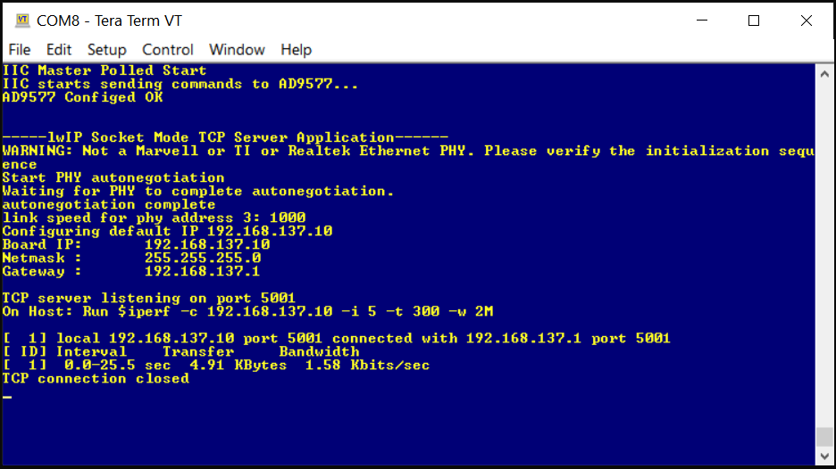
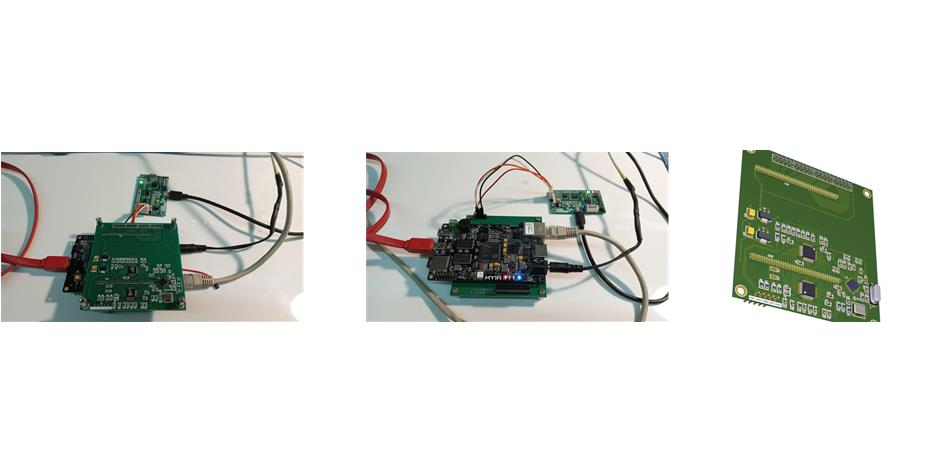

# 

 
This repository is about Interfacing ZYNQ SoC device to high-speed ADC (AD9288) and implementing a TCP/IP connection between a PC as a host and the ZYNQ device through LwIP in socket mode. An evaluation ZYNQ-based board (Z-Turn) along with a designed hardware consists of two ADC and a clock generator chip have been used. The clocking configuration between the PL section of ZYNQ and the ADCs are implemented in system-synchronous solution. So a common differential clock pulse is applied to both ADCs and the PL. A clock-distributor chip (AD9577) is used to build the desired clock pulse with the frequency of 72MHz. The AD9577 chip is provided by a local oscillator of 24MHz. The configuration of AD9577 chip is done by software codes through I2C connectivity of PS section of the ZYNQ device.  
 
The project has been developed by Vivado and Vitis (ver:2020.1). As shown in block-design the four ADC channels (each ADC has two 8-bit channel) is read and stored in a FIFO memory in the PL section synchronized with ADC clock pulse (72MHz) and the data from the FIFO is read by DMA (Direct Memory Access) IP with internal PL clock from PS (100MHz). The DMA in the PL is controlled by the software (PS) and the data is written to the DDR memory on the board.  
 
 Block Design in Vivado:
 
 
  
  
 The software in the PS section is based on freeRTOS which handles the I2C, DMA and LwIP functionalities. In software (PS) the ADC data is sent through LwIP (configured as server in socket mode) to the client application on the host PC. A Java program (developed through NetBeansIDE) running on the host establishes a socket connection as client to the Ethernet of the ZYNQ board and receives the data and monitors the four ADC channels on the graphical panel.
  
  
Monitoring ADC data in Java Application (Analog signal 2MHz, Sampling 72MSPS):

 
Serial console:

 
Hardware images:

 
 

## Author:
### Hamid Reza Tanhaei

